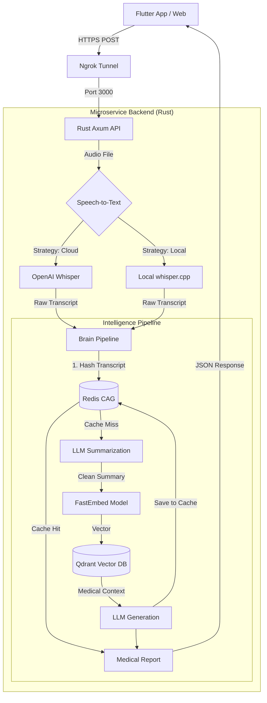

# 🩺 Doctor Assistant AI

<div align="center">
  
  
  
  
  
  
</div>
<br>

**Doctor Assistant AI** is a high-performance, robust backend system built entirely in **Rust**. It is designed to act as an intelligent co-pilot for medical professionals. By capturing patient audio (e.g., during consultations or visits), the system transcribes the spoken words with extremely high accuracy—specifically optimized for complex dialects like **Egyptian Arabic mixed with English medical terminology**—and will ultimately generate comprehensive, structured AI medical reports to streamline doctors' workflows.

---

## ✨ Key Features
- **Highly Accurate Speech-to-Text**: Optimized out-of-the-box for Egyptian Arabic and English code-switching using smart prompting.
- **Dual Recognition Engine**: 
  - **OpenAI API**: Fast, cloud-based transcription using the Whisper-1 model.
  - **Local Whisper (whisper.cpp)**: Offline, privacy-first transcription using the `whisper-rs` engine.
- **Cache-Augmented Generation (CAG)**: Utilizes Redis to cache expensive LLM report generations based on transcript hashes, drastically reducing latency and API costs.
- **Retrieval-Augmented Generation (RAG)**: Uses `fastembed` (AllMiniLML6V2) locally in Rust to generate vector embeddings and retrieves similar medical context from **Qdrant** Vector DB.
- **Robust API Layer**: Built on `axum`, offering high-performance async endpoints for seamless integration with frontend or mobile applications.
- **Ngrok Tunneling**: Built-in Ngrok integration for instant, secure HTTPS public exposure for webhook and mobile integration testing.
- **Microservices Architecture**: Strictly adheres to software engineering best practices, including Strategy, Factory, and Dependency Injection patterns (`AppState`).

---

## 🏗️ System Architecture

Our system is designed for maximum throughput, low latency, and absolute stability. The following diagram illustrates the flow of a single patient consultation:



---

## 📂 Folder Structure

```text
doctor_assist/
├── .env.example           # Template for environment variables and API keys
├── docker-compose.yml     # Multi-container orchestration (API, Qdrant, Redis, Ngrok)
├── Dockerfile             # Multi-stage optimized build for the Rust application
└── src/
    ├── api/               # External REST Interface
    │   └── routes.rs      # Axum endpoints and application state management
    ├── brain/             # Core Intelligence & Business Logic
    │   ├── pipeline.rs    # Main orchestrator (STT -> CAG -> RAG -> Report)
    │   ├── llm.rs         # OpenAI and OpenRouter client
    │   └── rag/           # Retrieval-Augmented Generation components
    │       ├── embedder.rs   # Local text-to-vector embedding (fastembed)
    │       ├── qdrant_db.rs  # Vector database client for semantic search
    │       └── redis_cache.rs# Cache-Augmented Generation (CAG) layer
    ├── core/              # Foundation
    │   └── config.rs      # Secure environment variable parsing
    ├── services/          # Independent Service Modules
    │   ├── local_audio/   # Local whisper.cpp speech-to-text implementation
    │   ├── openai_audio/  # Cloud OpenAI Whisper implementation
    │   └── speech_recognition.rs # Factory and Strategy pattern definitions
    └── main.rs            # Application entrypoint
```

---

## ⚙️ Getting Started

### Prerequisites
- [Docker](https://docs.docker.com/get-docker/) and [Docker Compose](https://docs.docker.com/compose/install/)
- An OpenAI API Key or OpenRouter API Key
- Ngrok Auth Token (Optional, for public URL)

### Setup & Launch
1. **Clone the repository**:
   ```bash
   git clone https://github.com/blackeagle686/doctor_assitant_ai.git
   cd doctor_assitant_ai
   ```

2. **Configure Environment Variables**:
   Copy the example config and fill in your details:
   ```bash
   cp .env.example .env
   nano .env
   ```

3. **Run the Infrastructure via Docker Compose**:
   Our setup automatically builds the Rust image, starts Qdrant, starts Redis, and establishes the Ngrok tunnel.
   ```bash
   docker-compose up --build -d
   ```

4. **Get your Public HTTPS URL**:
   ```bash
   docker-compose logs ngrok | grep url=
   ```
   *Your API is now live and ready to accept traffic on this URL!*

---

## 🗺️ Roadmap

- [x] **Phase 1: Foundation & Audio Capture**
- [x] **Phase 2: Transcription Engine (The "Ears")**
  - Factory/Strategy patterns for AI models (Cloud & Local).
- [x] **Phase 3: Network & API**
  - High-performance `axum` async REST API.
- [x] **Phase 4: Intelligence & Reporting (The "Brain")**
  - Cache-Augmented Generation (CAG) with Redis.
  - Retrieval-Augmented Generation (RAG) with `fastembed` and Qdrant.
  - LLM pipeline for Medical Report structuring.
- [x] **Phase 5: DevOps & Containerization**
  - Multi-stage Dockerfile and Docker-Compose orchestration.
- [ ] **Phase 6: Frontend Integration**
  - Connect the Flutter App to the backend via the Ngrok Tunnel.

---
*Built with passion to empower healthcare professionals with cutting-edge AI.*
